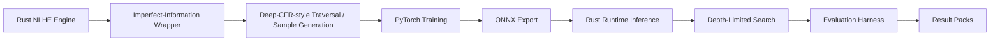

# Architecture

Talibus is organized around a training-time Deep-CFR-style pipeline and a
runtime decision pipeline.

## System Flow

This diagram shows the research pipeline used inside the repository. The
runtime/search pieces are for simulator evaluation and experimentation; they
are not a live-play assistant or poker-site automation system.

## Game And Abstraction

The Rust workspace in `solver/` contains the game and solver core.

- `solver/game` implements NLHE game mechanics: seats, blinds, betting rounds,
  stacks, pots, board cards, terminal states, and showdown.
- `solver/cfr/src/nlhe_game.rs` wraps the game as an imperfect-information
  model. It builds information sets from the acting player, street, card
  bucket, board bucket, and betting history.
- The action space is abstracted into fixed policy slots rather than arbitrary
  continuous bet sizing. Slots include fold/check/call, multiple bet/raise
  sizes, and all-in.
- Postflop representation uses cluster assets from `checkpoints/nlhe_clusters`.

## Deep CFR-Style Training

The traversal code in `solver/deep_cfr/src/traverse.rs` samples game states and
produces training samples.

- Traverser nodes enumerate legal abstract actions and record advantage-like
  samples.
- Opponent nodes sample actions from the current neural policy estimate.
- Samples are serialized for Python training.

The Python stack in `training/deep_cfr` trains neural networks from those
samples.

- `model.py` defines the dense PyTorch model.
- `train.py` loads binary sample files and trains advantage/strategy heads.
- `reservoir.py` implements in-memory and disk-backed sample management.
- `run_deep_cfr.py` orchestrates traversal, training, checkpoints, diagnostics,
  panel evaluation, and long-run state.

## Experiment Configuration And Preparation Provenance

`training/deep_cfr/experiment.py` provides a small versioned JSON contract for
core fresh-run settings. `provenance.py` collects preparation evidence. These
modules do not launch the pipeline or migrate existing training, evaluation,
result-pack, bundle, or release formats.

The three representations have distinct meanings:

1. **Input configuration** records intent. The checked-in
   `training/deep_cfr/experiments/example.json` illustrates all groups below.
2. **Resolved configuration** records validated settings a future consumer is
   prepared to use, after explicit overrides and supported defaults. It does
   not establish that any setting was used by an executed workload.
3. **Preparation manifest** embeds the resolved configuration and records a
   caller-supplied `run_id`, `phase: "prepared"`, UTC timestamp, Git evidence,
   Python environment evidence, explicitly registered artifacts, and collection
   warnings. It contains no completion status or experimental metrics.

Input and manifest envelopes independently use `schema_version: 1`. Unsupported
versions and unknown fields fail; there is no migration or extension-field bag.

| Input group | Fields |
| --- | --- |
| Top level | `schema_version`, `name`, `seed` |
| `game` | `num_players`, `starting_stack`, `small_blind`, `big_blind` |
| `run` | `iterations`, `strategy_every` |
| `model` | `hidden_dim`, `bottleneck_dim`, `dropout_p` |
| `traversal` | `traversals`, `deck_samples`, `workers`, `progress_batch`, `seat_chunks`, `consolidate_processes` |
| `training` | `training_steps`, `batch_size`, `lr`, `weight_decay`, `buffer_size`, `max_sample_reuse_per_iter`, `adv_huber_delta` |
| `execution` | `device` |
| `export` | `onnx_opset` |
| `paths` | `cluster_dir`, `output_dir`, each containing `root` and `path` |

Every group and field is required except the three individual model settings.
Omitted model settings use `model.ModelConfig`; the resolved form always contains
them, plus canonical `input_dim` and `max_actions`. Input files cannot override
those dimensions. The example spells out model settings explicitly.

Seeds are integers from 0 through 2^32-1. Booleans are not accepted as numbers.
Counts must be positive, except `strategy_every=0` disables strategy training
and `workers=0` requests automatic worker selection. Non-finite values, duplicate
JSON keys, invalid types, invalid paths, and missing/unknown fields fail clearly.
The game requires 2-6 players and small blind <= big blind <= starting stack.
Seat chunks cannot exceed traversals; consolidation requires more than two
players and one seat chunk. Dropout is in [0, 1); weight decay may be zero.
Other training floating-point settings must be positive. `traversals` is a
per-player budget, and `training_steps` is a requested limit.

Resolution validates input before applying optional seed/output-directory
overrides, then validates the result. Absent overrides preserve the input.
The frozen input object remains unchanged. Device resolution reuses
`train.resolve_device`: CPU stays CPU; `auto` or `cuda` selects CUDA only when
available and otherwise selects CPU. Resolved `execution` records
`requested_device` and `selected_device`; selection performs no model work.
It is a preparation observation, not evidence that the device ran training.

Resolved traversal settings rename `workers` to `requested_workers`, preserving
zero and explicit counts even when Rust may later clamp them. No actual worker
count is predicted. A future execution consumer must record observed workers,
effective batch/step counts, derived subprocess seeds, and additional execution
parameters when applicable. Current training/evaluation CLIs do not consume this
configuration. Resume, diagnostic selection, GPU batching, and evaluation/search
options are outside this first contract.

### Portable Resource Roots

Every resource reference is a JSON object such as
`{"root": "repo", "path": "checkpoints/nlhe_clusters"}` or
`{"root": "run", "path": "example/models/model.onnx"}`.

- `repo` binds to the local checkout root.
- `run` binds to a local artifact storage root, which may be outside the checkout.
- `paths.output_dir` must use `run`. Its example value is `example`, so future
  outputs would live below the bound run root's `example` directory.
- Artifact references use these same roots. They are not implicitly relative to
  `output_dir`: a file there is explicitly `run:example/models/model.onnx`.

`LocalRoots(repo=..., run=...)` accepts absolute local `Path` bindings in memory;
bindings never enter the config or manifest. Its `bind(PathRef(...))` method
checks containment after resolving symlinks. This supports external Windows
artifact storage without serializing drive names. Configuration resolution is
independent of the invoking working directory. CLI root arguments are local
bindings and may be supplied relative to the command's working directory.

Serialized paths use forward slashes. Absolute paths, drives/UNC paths, `..`,
backslashes, control characters, Windows reserved components, and unsupported
path characters fail. `~` and environment-variable expansion are not performed.
Redundant `.` and separators normalize; `.` denotes the bound root itself.
Preparation checks path containment but does not require future output files or
directories to exist and does not create them.

### Evidence And Serialization Boundaries

Git collection uses an explicit repository root and five-second timeouts per
command. It records the full HEAD SHA and staged, unstaged, and non-ignored
untracked dirty state. Missing Git or an unavailable checkout produces null
values with a reason, never a fake SHA or a false clean state. Partial failures
retain known evidence. A directory nested inside a different checkout is not
silently attributed to that parent repository.

Runtime fields are Python implementation/version, OS system/release, machine
architecture, and installed NumPy/PyTorch distribution versions. A missing
distribution yields null plus a collection warning. These are preparation-time
Python environment observations, not the version of an ONNX Runtime library
loaded by a Rust process. Hostnames, usernames, remotes, environment dumps, and
local executable paths are not collected.

Library callers can register existing files using
`build_manifest(..., artifacts=[("input", PathRef("run", "example/input.bin"))])`.
Each record contains `role`, `root`, `path`, `size_bytes`, and `sha256`. Files are
read explicitly, never recursively discovered. Missing/unreadable files and
symlink escapes fail. The CLI registers no artifacts by default. Hashes identify
the bytes read, so callers should register stable files rather than files being
modified concurrently.

`canonical_json` sorts keys, uses two-space indentation, ASCII escaping,
`allow_nan=False`, and exactly one trailing LF. Encode its result as UTF-8 when
writing files; the CLI writes UTF-8/LF bytes. Artifact and warning collections
have stable ordering. With injected identical clock/provenance observations,
manifest serialization is deterministic; live timestamps and environments may
legitimately differ. No configuration hash or artifact registry is provided.

This contract does not guarantee deterministic execution. Seeds alone do not
control all subprocesses, scheduling, sample ordering, PyTorch operations, or
platform/version-dependent floating-point results. Effective training limits can
depend on sample/reservoir contents. A commit plus dirty flag does not capture
uncommitted code or ignored external inputs. Unregistered artifacts are not
identified, and a hash does not ensure that a file remains available. Historical
long-run reproduction and cross-runtime numerical parity are separate work.

## Feature Encoding

`solver/deep_cfr/src/encoding.rs` converts poker states into fixed-size model
features. The encoded state includes private cards, board cards, street,
position, pot and stack information, legal-action masks, player activity, and
recent action history.

## Model Deployment

Trained PyTorch models are exported to ONNX. The Rust runtime loads these ONNX
models for inference so evaluation and depth-limited search experiments can run
without Python in the decision loop.

`solver/deep_cfr/src/onnx_policy.rs` handles ONNX inference and legal-action
normalization.

## Runtime Search

`solver/deep_cfr/src/realtime_search.rs` adds experimental depth-limited local
search from a current simulator state. The neural policy acts as the
baseline/continuation model, while the search refines the root decision within
a budget.

Despite the internal file and binary names, this is not documented or intended
as a real-time poker assistant, overlay, real-money tool, or platform
automation system.

The relevant binaries are:

- `ring_game_eval`: model-only ring evaluation against scripted opponents.
- `realtime_play`: depth-limited search evaluation and interactive/runtime
  experimentation modes.
